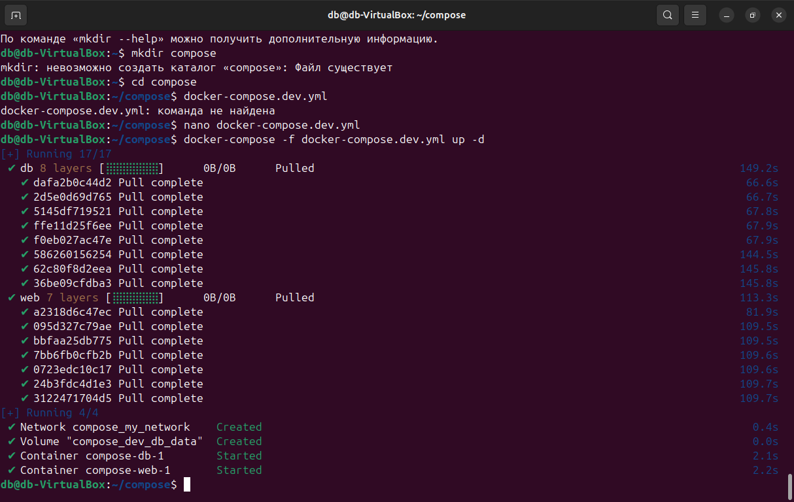
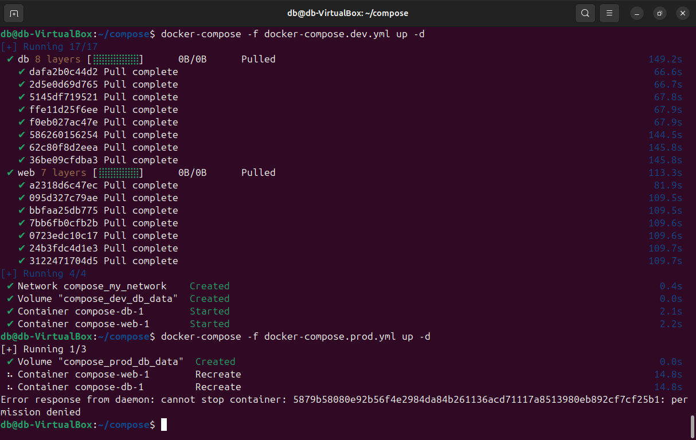
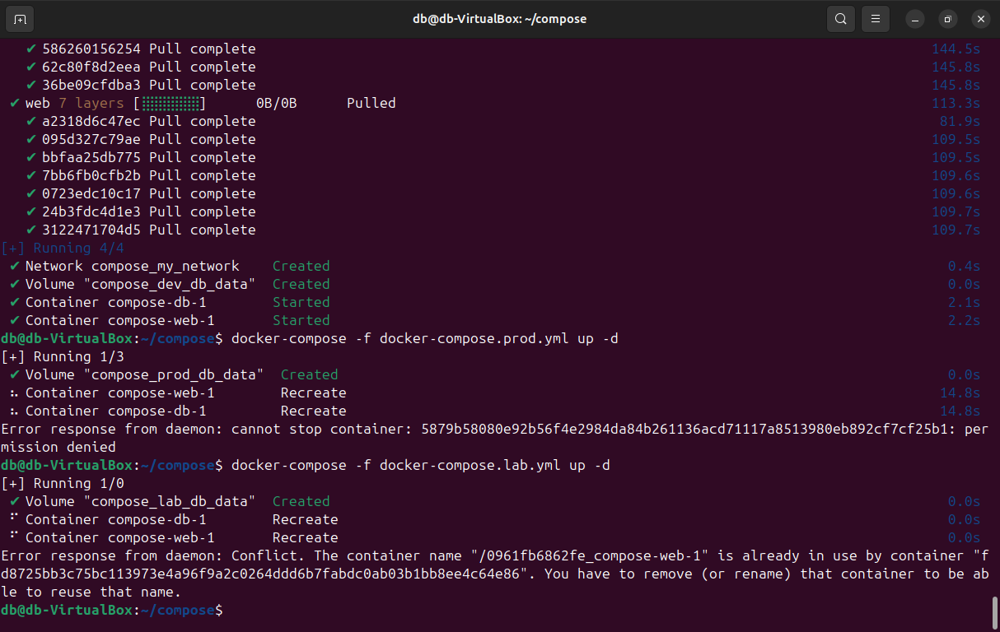
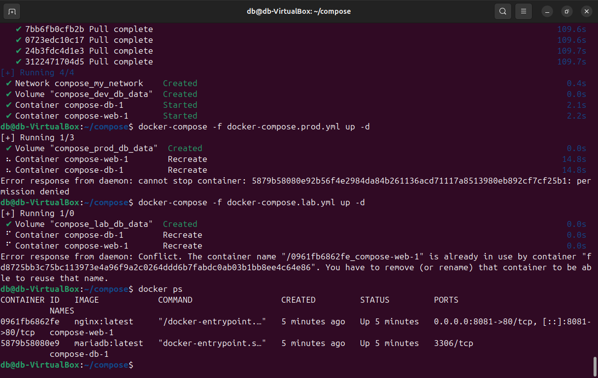
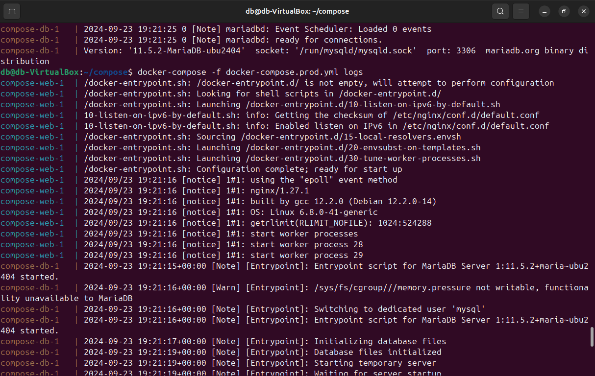
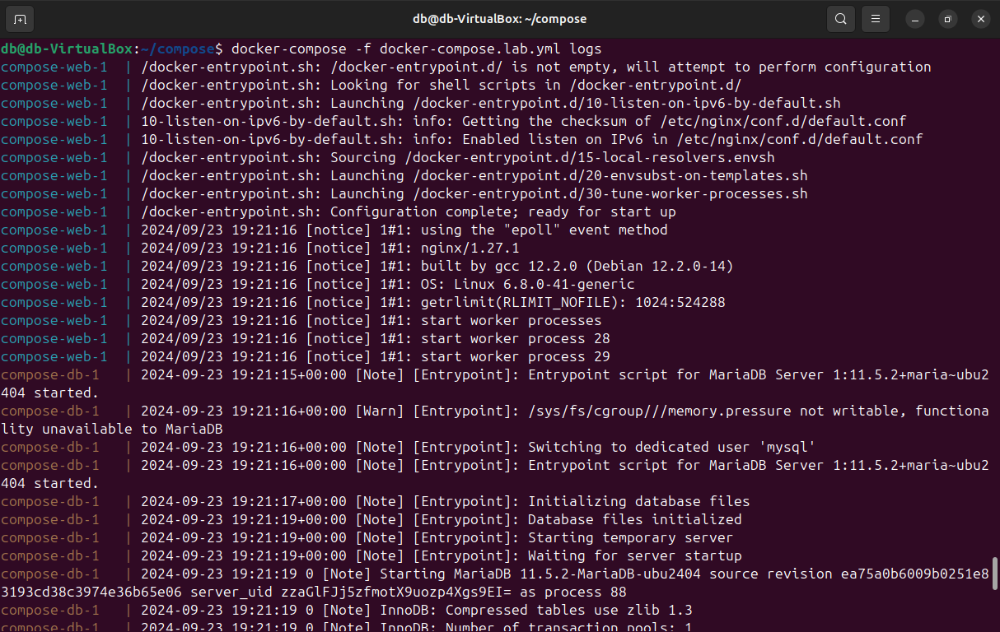
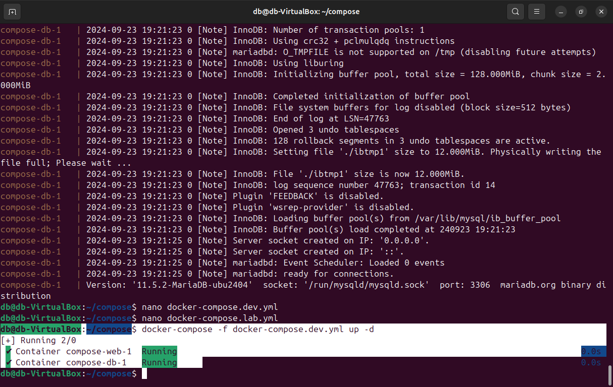
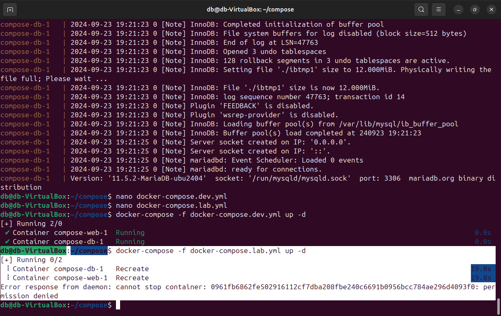
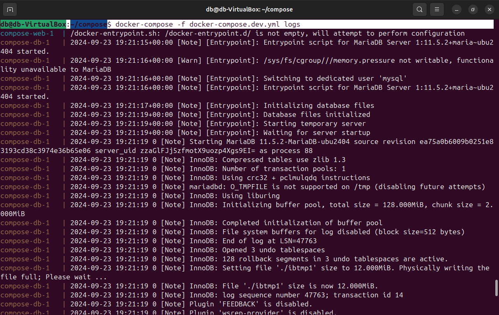
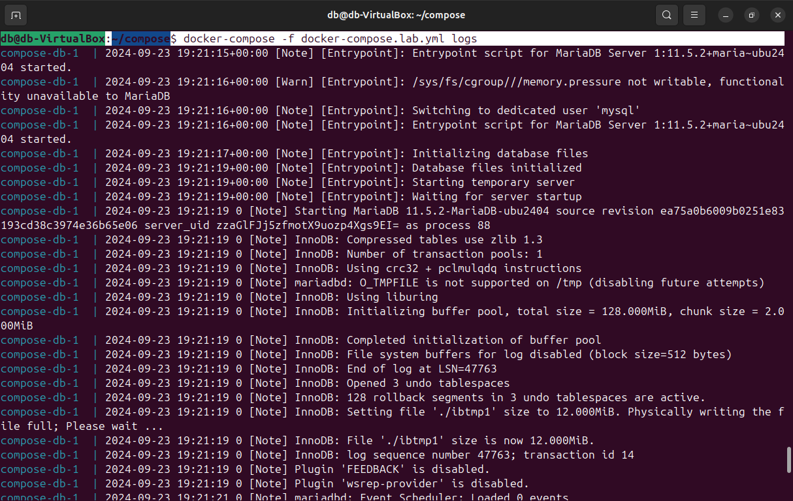

# Kontejnerizatsija
# Задание 1:
1) Создать сервис, состоящий из 2 различных контейнеров: 1 - веб, 2 - БД
2) Далее необходимо создать 3 сервиса в каждом окружении (dev, prod, lab)
3) По итогу на каждой ноде должно быть по 2 работающих контейнера
4) Выводы зафиксировать

**Создание сервиса с двумя контейнерами: веб и БД:**
   - Веб-контейнер будет использовать Nginx.
   - Контейнер для базы данных будет на основе MariaDB.

   Для этого нужно создать **Docker Compose файл** для каждого окружения (dev, prod, lab), который описывает два сервиса: один для веб-приложения, другой для базы данных.

*Docker Compose файл для окружения dev (docker-compose.dev.yml):*
```yaml
version: '3'
services:
  web:
    image: nginx:latest
    ports:
      - "8081:80"
    networks:
      - my_network
  db:
    image: mariadb:latest
    environment:
      MYSQL_ROOT_PASSWORD: devpassword
    volumes:
      - dev_db_data:/var/lib/mysql
    networks:
      - my_network

networks:
  my_network:

volumes:
  dev_db_data:
```

*Docker Compose файл для окружения prod (docker-compose.prod.yml):*
```yaml
version: '3'
services:
  web:
    image: nginx:latest
    ports:
      - "80:80"
    networks:
      - my_network
  db:
    image: mariadb:latest
    environment:
      MYSQL_ROOT_PASSWORD: prodpassword
    volumes:
      - prod_db_data:/var/lib/mysql
    networks:
      - my_network

networks:
  my_network:

volumes:
  prod_db_data:
```

*Docker Compose файл для окружения lab (docker-compose.lab.yml):*
```yaml
version: '3'
services:
  web:
    image: nginx:latest
    ports:
      - "8082:80"
    networks:
      - my_network
  db:
    image: mariadb:latest
    environment:
      MYSQL_ROOT_PASSWORD: labpassword
    volumes:
      - lab_db_data:/var/lib/mysql
    networks:
      - my_network

networks:
  my_network:

volumes:
  lab_db_data:
```

**Развертывание контейнеров на трех нодах (dev, prod, lab):**
   После того как созданы файлы для каждого окружения, необходимо выполнить следующие команды для развертывания контейнеров:

*Для dev:*
```bash
docker-compose -f docker-compose.dev.yml up -d
```

*Для prod:*
```bash
docker-compose -f docker-compose.prod.yml up -d
```

*Для lab:*
```bash
docker-compose -f docker-compose.lab.yml up -d
```





**Проверка работы:**
   Для проверки работы контейнеров используем команду на трех нодах (dev, prod, lab):

```bash
docker ps
```
Скриншот с работающими контейнерами на всех трёх нодах:


### Вывод логов из разных окружений:
1. Для **dev** окружения:
   ```bash
   docker-compose -f docker-compose.dev.yml logs
   ```


2. Для **prod** окружения:
   ```bash
   docker-compose -f docker-compose.prod.yml logs
   ```
   

3. Для **lab** окружения:
   ```bash
   docker-compose -f docker-compose.lab.yml logs
   ```
   


# Задание 2:
1) Нужно создать 2 ДК-файла, в которых будут описываться сервисы
2) Повторить задание 1 для двух окружений: lab, dev
3) Обязательно проверить и зафиксировать результаты, чтобы можно было выслать преподавателю для проверки

**Создание сервиса с двумя контейнерами: веб и БД:**
   - Веб-контейнер будет использовать Nginx.
   - Контейнер для базы данных будет на основе MariaDB.

   Для этого нужно создать **Docker Compose файл** для каждого окружения (dev, lab), который описывает два сервиса: один для веб-приложения, другой для базы данных.

*Docker Compose файл для окружения dev (docker-compose.dev.yml):*
```yaml
version: '3'
services:
  web:
    image: nginx:latest
    ports:
      - "8081:80"
    networks:
      - my_network
  db:
    image: mariadb:latest
    environment:
      MYSQL_ROOT_PASSWORD: devpassword
    volumes:
      - dev_db_data:/var/lib/mysql
    networks:
      - my_network

networks:
  my_network:

volumes:
  dev_db_data:
```

*Docker Compose файл для окружения lab (docker-compose.lab.yml):*
```yaml
version: '3'
services:
  web:
    image: nginx:latest
    ports:
      - "8082:80"
    networks:
      - my_network
  db:
    image: mariadb:latest
    environment:
      MYSQL_ROOT_PASSWORD: labpassword
    volumes:
      - lab_db_data:/var/lib/mysql
    networks:
      - my_network

networks:
  my_network:

volumes:
  lab_db_data:
```

**Развертывание контейнеров на двух нодах (dev, lab):**
   После того как созданы файлы для каждого окружения, необходимо выполнить следующие команды для развертывания контейнеров:

*Для dev:*
```bash
docker-compose -f docker-compose.dev.yml up -d
```

*Для lab:*
```bash
docker-compose -f docker-compose.lab.yml up -d
```





### Вывод логов из разных окружений:
1. Для **dev** окружения:
   ```bash
   docker-compose -f docker-compose.dev.yml logs
   ```


2. Для **lab** окружения:
   ```bash
   docker-compose -f docker-compose.lab.yml logs
   ```
   
**Выполнил студент GB: Коваль С. А. группы разработчиков**

